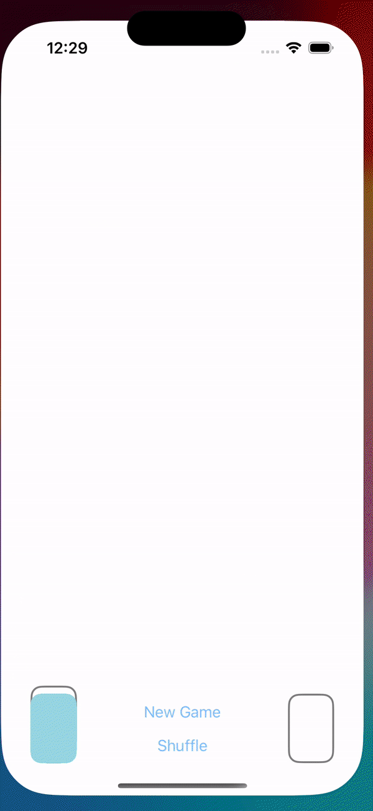

# SetSwiftUI

## Overview

SetSwiftUI is an interactive iOS application implementing the popular card game Set, built using SwiftUI. This project is built using the MVVM architectural pattern and the focusing is on creating an engaging user experience with eye-catching animation.

## Features

### 🔁 MVVM Architecture
- **Model-View-ViewModel**: This architecture was chosen to separate logic and UI in order to enhance maintainability and scalability. The `SetGame` Model handles the game logic, the `SetGameView` View manages the UI and the `SetGameViewModel` ViewModel binds the View to the Model, interprets the Model on behalf of the View and communicates user intentions from the View to the Model.

### 🌟 Animations and Transitions
-  **Implicit and Explicit Animations**: Smoothly integrated for user interactions.
- **Transitions and Matched Geometry Effect**: Enhance the visual appeal by animating view appearances and movements.

### 🔸 Custom Shapes, and ViewModifiers
- **ViewModifier for Cards**: Cardify is a custom ViewModifier that stylizes standard views into game cards, showcasing reusability in SwiftUI.
- **Custom Diamond Shape**: Demonstrates UI drawing using path(in:).

### 📱 Dynamic UI and Responsive Design
- **GeometryReader**: Ensures that the UI dynamically adapts to different device sizes.
- **LazyVGrid with Adaptive Layout**: AspectVGrid uses this to provide a responsive card layout.

### 🫵 Enumerations and State Management
- **Game Logic**: SetGame struct contains all game logic, maintaining clean separation from the UI.
- **Triad Enum**: Used for card properties, demonstrating efficient use of Swift enums.
- **Card State Management**: The SetGame.CardState enum manages various states of a card like selected, matched, and mismatch.

